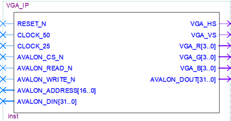
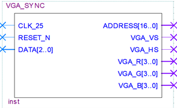

# VGA IP

## Architectural overview

##### VGA-IP is the top-level in the design.

##### VGA_sync

---
## I/O tables

In signals
|Name | Description| 
|-----|------|
|CLOCK_50 |System clock|
|reset_n | reset (user input)|
|SW[2..0] |Switch (user input)|

Out signals
|Name | Description |
|-----|------|
|VGA_VS | System clock|
|VGA_HS |System clock|
|VGA_R[3..0] |  Red color|
|VGA_G[3..0] |  Green color|
|VGA_B[3..0] |  Blue color|

---